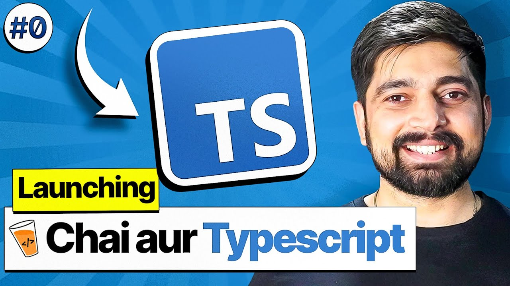

  

# Chai Aur TypeScript!

A simple and clean repository documenting my journey of learning **TypeScript** with Hitesh Sir’s series.

## What’s Inside?
- Basics of TypeScript
- Type checking & type safety
- Exploring TypeScript Playground
- Hands-on practice files
- Notes as I understand how TS works under the hood

## Goal
Build a strong foundation in TypeScript while improving consistency, confidence, and clean coding habits.

## Acknowledgements
Thanks to **Hitesh Choudhary Sir** for simplifying TypeScript and guiding the journey with clarity and motivation.

---

Stay tuned for more updates!
